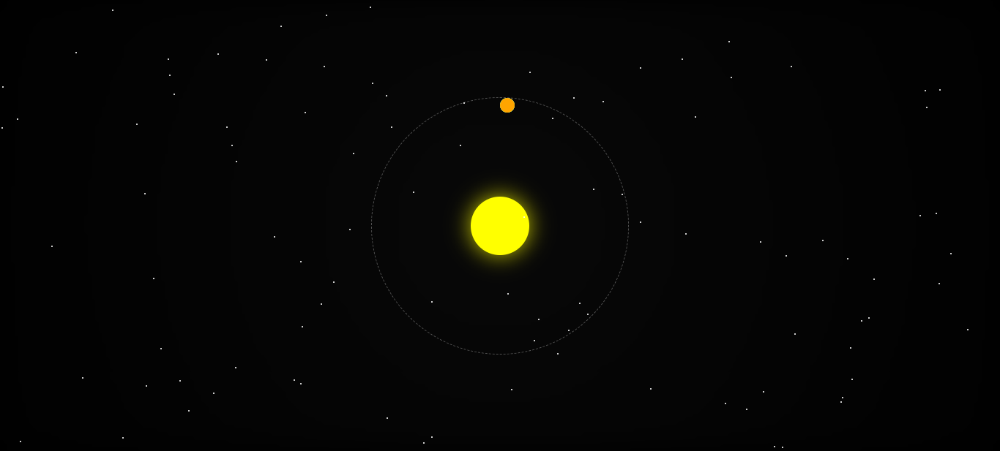

# Orbit Animation with Stars, Falling Stars, and Milky Way Effect

Animasi ini menampilkan simulasi sistem orbit sederhana menggunakan HTML, CSS, dan JavaScript. Elemen-elemen dalam animasi ini meliputi matahari sebagai pusat orbit, beberapa planet, bintang statis sebagai latar belakang, bintang jatuh, serta efek Bima Sakti yang memberikan kesan kabut di angkasa.

## Fitur Animasi

1. **Matahari di Pusat Orbit** - Sebuah lingkaran berwarna kuning yang berperan sebagai pusat orbit.
2. **Planet Berorbit** - Tiga planet berwarna berbeda yang mengelilingi matahari dengan kecepatan dan ukuran orbit yang berbeda.
3. **Bintang Latar Belakang** - Bintang kecil yang berkelap-kelip, tersebar secara acak di latar belakang.
4. **Bintang Jatuh** - Bintang jatuh secara acak dengan efek kilatan, memberikan kesan angkasa yang dinamis.
5. **Efek Bima Sakti** - Kabut berputar di latar belakang yang memberikan kesan galaksi dengan efek rotasi yang lambat.

## Struktur File

- **HTML**: Struktur dasar halaman dan kontainer elemen untuk matahari, planet, dan efek Bima Sakti.
- **CSS**: Styling dan animasi untuk elemen-elemen seperti orbit, bintang, planet, dan efek Bima Sakti.
- **JavaScript**: Logika untuk menambahkan bintang statis dan bintang jatuh secara acak di layar.

## Cara Menjalankan

1. **Clone atau unduh** repository ini ke komputer Anda.
2. Buka file `index.html` menggunakan browser (Chrome, Firefox, atau browser modern lainnya).
3. Anda akan melihat animasi orbit dengan matahari, planet, bintang berkelap-kelip, bintang jatuh, dan efek Bima Sakti di latar belakang.

## Kode Utama

- **Orbit Container**: `orbit-container` digunakan sebagai jalur orbit bagi planet.
- **Animasi Matahari**: `sun` adalah elemen statis di pusat orbit.
- **Planet**: Terdapat tiga planet dengan animasi rotasi yang mengelilingi matahari.
- **Bintang**: Bintang statis dibuat menggunakan elemen `.star`, dan bintang jatuh menggunakan `.falling-star`.
- **Efek Bima Sakti**: `milky-way` adalah elemen dengan efek kabut yang berotasi secara perlahan.

## Contoh Kode

Berikut ini adalah potongan kode untuk elemen utama animasi orbit:

```html
<div class="orbit-container">
    <div class="sun"></div>
    <div class="planet planet-1"></div>
    <div class="planet planet-2"></div>
    <div class="planet planet-3"></div>
</div>
```

### CSS untuk Animasi Bintang Jatuh
```css
@keyframes fall {
    0% { transform: translateY(0) translateX(0); opacity: 1; }
    100% { transform: translateY(200vh) translateX(100vw); opacity: 0; }
}
```

## Teknologi yang Digunakan

- **HTML**: Untuk struktur markup dasar.
- **CSS**: Untuk styling elemen dan animasi.
- **JavaScript**: Untuk menambahkan bintang secara acak di latar belakang.

## Pengembangan Lebih Lanjut

- Menambahkan lebih banyak planet dengan warna dan kecepatan orbit yang berbeda.
- Menambahkan efek suara untuk memberikan pengalaman yang lebih immersif.
- Memperluas animasi bintang jatuh agar terjadi lebih sering atau dengan arah acak.

## Screenshot



## Lisensi

Proyek ini bebas digunakan untuk tujuan pribadi atau pendidikan.

---

Selamat mencoba dan semoga animasi ini bermanfaat untuk pemahaman dasar tentang CSS animasi dan JavaScript untuk manipulasi DOM sederhana!
```
